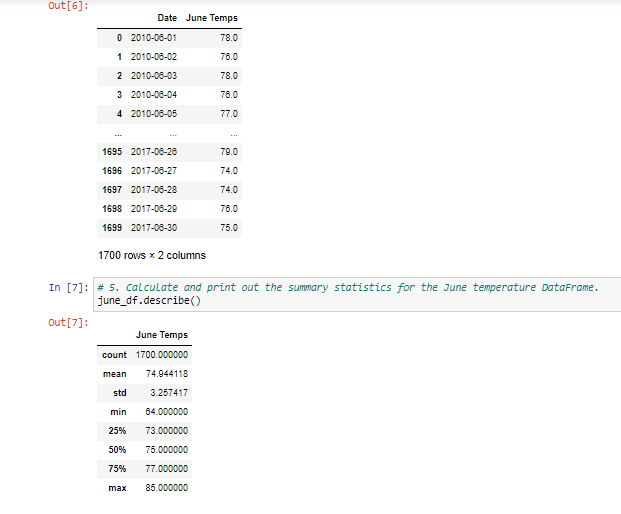
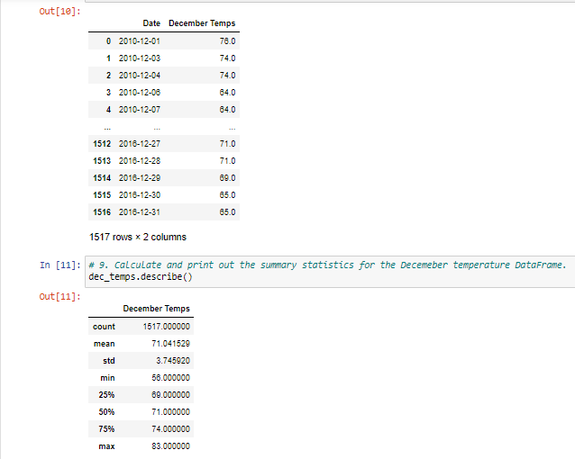
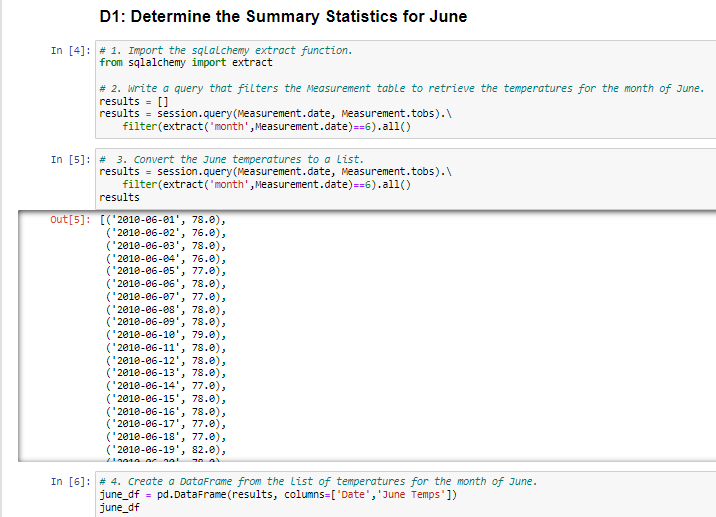

# Surfs_Up

## Overview of the Surfs-Up Analysis

While returning from Hawaii, I brought something unexpected with me.  I brought a dream of starting a surf and shake shop in Oahu.  After crafting a foolproof business plan and saving some money, I sought help from a local investor, Mr. W. Avy.  Mr. W. Avy knows that I am learning data analytics and wants an analysis on some Oahu weather data he maintains.
 
### Resources

* Data Source:  hawaii.sqlite, climate_analysis.ipynb, SurfsUp_Challenge.ipynb
* Software:  Python 3.6.1, Jupyter Notebook (anaconda3), Visual Studio Code, 1.38.1
* Packages:  Pandas, NumPy, SQLAlchemy, Flask, datetime

## Surfs-Up Analysis Results

### June Data

PyBer Summary Data Frame:

### December Data

PyBer Summary Data Frame:

#### Bullet #1:  Average temperature in June is only 4 degrees higher than in December

#### Bullet #2:  The maximum temperature in June is only 2 degrees highter than in December

#### Bullet #3:  The minimum temperature in June is 8 degrees higher than in December
      
## Summary of Results and Recommendations

While the average and maximum temperatures were very close, the minimum temperatures changed more dramatically.  If we had access to additional data, we could perform more powerful analyses.  For example, we could:

    1.  Develop a query to perform the same analysis with the percipitation data, and 
    
    2.  Develop a query to understand when the tourists travel to Oahu.

## PyBer Analysis Code Snippets

SQLite query:

